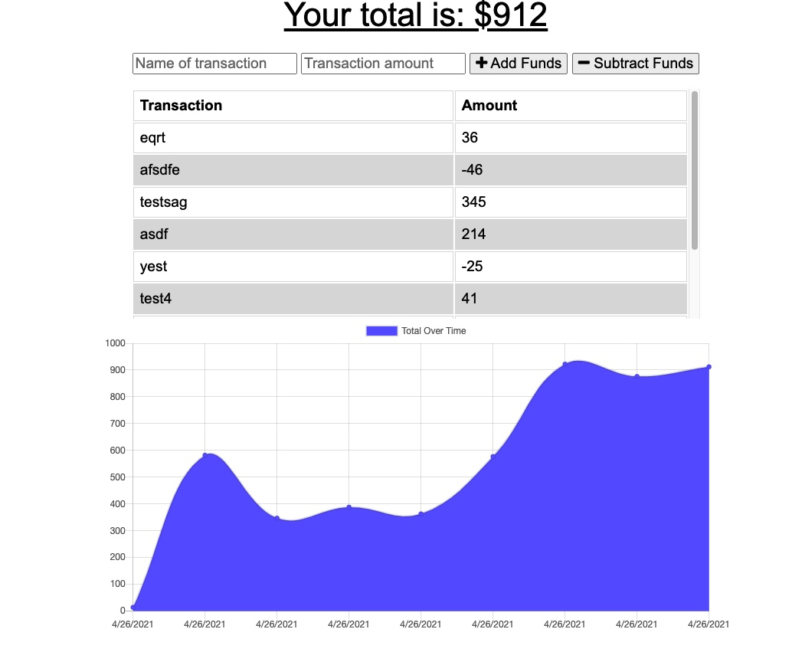

# Fitness Tracker

## Table of Contents
* [Description](#description)
* [Installation](#installation)
* [Usage](#usage)
* [License](#license)
* [Questions](#questions)

## Description
Link to heroku deployed application: https://obscure-dusk-81782.herokuapp.com/

This is a budget tracker that allows for online and offline access and functionality. Users can expense their budget with or without a connection. Offline transactions will populate the total when broght back online. 

This is a Progressive Web Application that uses a partial express server to stroe data. An IndexedDB supports the offline functionality. It contains a manifest and service worker to allow the application to be downloaded to a mobile device, and a service-worker file to allow for caching of user requests and the dependent files. 

Here is a picture of the deployed application
 

## Installation
To install, download the Github Repo or clone it to your local repository. Then install the node dependencies by running npm install in your command line. You can start the application by running npm start or node server.js in the command line. 

## Usage
Go to https://obscure-dusk-81782.herokuapp.com/ to use the application

To run this locally, you'll need a MongoDB running. To use this on a mobile device, go to the URL and add it to the homescreen. Then, to use the offline functionality, turn on airplane mode. Once airplane mode is off, the interactions will go to the DB. 

## License
This repository is licensed under the MIT: (https://opensource.org/licenses/MIT) license.

